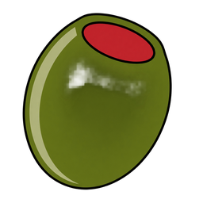

<p align="center">
  
</p>

<h1 align="center">OLIVE</h1>

<p align="center">A private AI assistant that runs on your own computer, with an iPhone companion.</p>

OLIVE (formerly DMDO) is a local-first desktop assistant. Chat, documents, coding,
notes, drawings, images, speech and video are processed on your computer, with
[Ollama](https://ollama.com) as the default model provider. There is no OLIVE
account, no hosted AI and no telemetry. The iPhone app sends requests to your
paired computer, which does the work.

> **OLIVE 1.0 is in preparation on this branch (`release/olive-1.0`).** No installer
> has been published yet for any platform. Today OLIVE runs from a source checkout
> (see [Running from source](#running-from-source)).

This is a private, proprietary source repository ([LICENSE](LICENSE)).

## Features

| Area | What OLIVE does |
| --- | --- |
| Chat | FAST, NORMAL and MAX local models, and UNCENSORED automatic routing over installed local models |
| Research | NOW: live web research with sources. DEEP: answers from your documents with page citations |
| Create | REIMAGINE image generation and editing, AUDIO speech, VIDEO with target durations, long-form segments and image-to-video, all inside Chat |
| Work | Agent Workspace coding tasks with diffs, tests and receipts; Studio IDE; desktop navigation on Linux (KDE) |
| Notes and Draw | Local-first notes and drawings that sync live with the iPhone, including offline edits |
| iPhone | Every desktop Chat mode (run by the computer), attachments, Notes, Draw, Today, Files, Remote Studio |
| Connect | Pairing with mutual confirmation, pinned TLS 1.3 between your devices, per-device permissions |
| Connect World | A relay you host lets the phone reach the computer from any network; automatic Direct ↔ World failover; the relay cannot read your content |
| Also | Mail with optional IMAP/SMTP and Gmail, Personal (calendar, tasks, reminders), the OLIVE GO browser |

OLIVE never downloads a model automatically. Modes whose model or engine is not
installed show *Needs setup*. Details: [chat modes](docs/features/chat-modes.md).

## Platform status

| Platform | OLIVE 1.0 | Today |
| --- | --- | --- |
| Linux desktop | Target | Runs from source (`run_olive.sh`); verified on CachyOS with KDE Plasma. Installer in preparation |
| Windows desktop | Target | Runs from source (`run_olive.bat`); current-tree acceptance pending. Installer in preparation; the first one may be unsigned |
| macOS desktop | Target | **Not supported yet**: credential storage and runtime management still need macOS implementations |
| iPhone | Companion | Developer install with Xcode ([iPhone](docs/mobile/README.md)); TestFlight later |

Measured hardware so far: one laptop with an RTX 3080 Ti (16 GB VRAM) and 64 GB RAM.
See [install status](docs/install/README.md) for what remains per platform.

## Running from source

Linux, with Python 3.11+, Node 22.12+ and npm:

```sh
./run_olive.sh
```

Windows, with Python 3.11+ and Node:

```bat
setup_windows.bat
cd desktop && npm ci && npm run build && cd ..
run_olive.bat
```

Install [Ollama](https://ollama.com) and the models you want separately. Your data
lives in `~/.olive` (Linux: `$XDG_DATA_HOME/olive`); an existing `~/.dmdo` profile is
reused in place. More: [development](docs/development/README.md).

Quality bar before a change is complete (see [AGENTS.md](AGENTS.md)):

```sh
python -m compileall -q -x "(^|[/\\])\.venv[/\\]" .
python -m unittest discover -s tests -v
cd desktop && npm run typecheck && npm run lint && npm test && npm run build
```

## Documentation

| | |
| --- | --- |
| [Documentation index](docs/README.md) | Everything below, organised |
| [Getting started](docs/getting-started/README.md) · [install status](docs/install/README.md) | What runs where; platforms |
| [Chat modes](docs/features/chat-modes.md) · [research](docs/features/research.md) · [video](docs/features/video.md) | Features |
| [Connect](docs/connect/README.md) · [Connect World](docs/connect-world/README.md) · [relay](world-relay/README.md) | Devices, protocols, self-hosted relay |
| [Architecture](docs/architecture/overview.md) · [legacy DMDO compatibility](docs/architecture/legacy-dmdo-compatibility.md) | How it fits together |
| [Project journey](docs/history/PROJECT_JOURNEY.md) | History from DMDO to OLIVE 1.0 |
| [CHANGELOG](CHANGELOG.md) · [SECURITY](SECURITY.md) · [third-party notices](THIRD_PARTY_NOTICES.md) | Release files |

OLIVE was formerly named DMDO. Legacy identifiers that hold your existing data are
kept on purpose; see the [compatibility map](docs/architecture/legacy-dmdo-compatibility.md).
