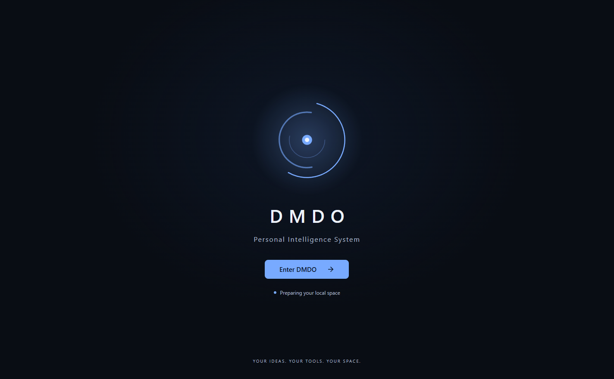
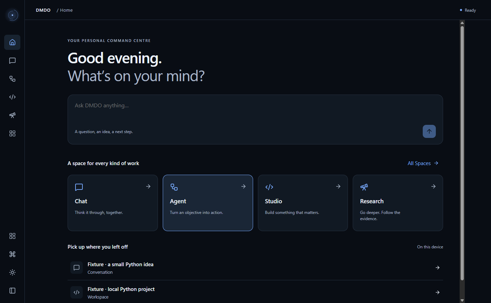
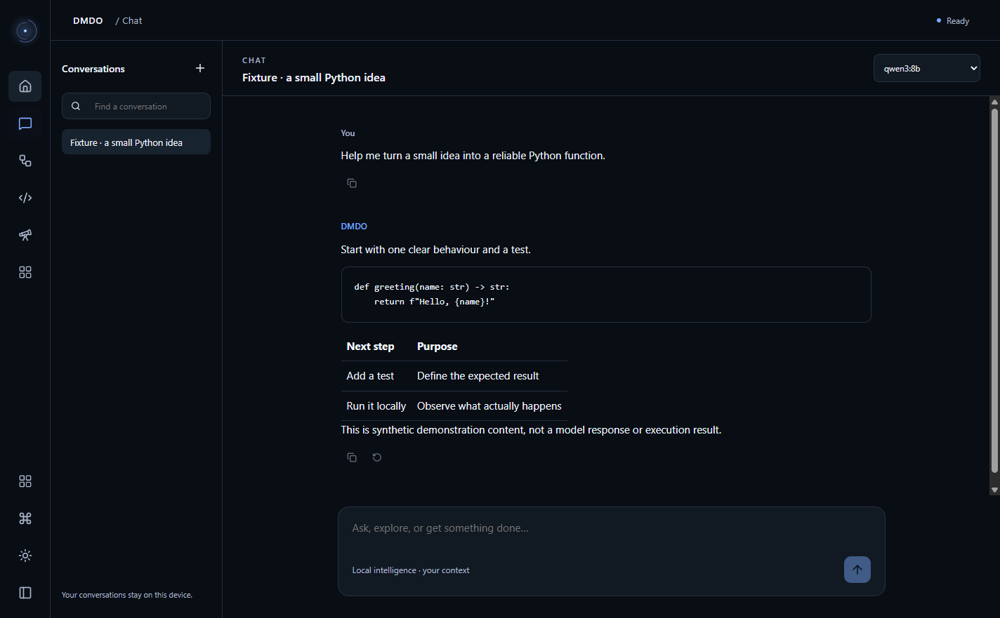
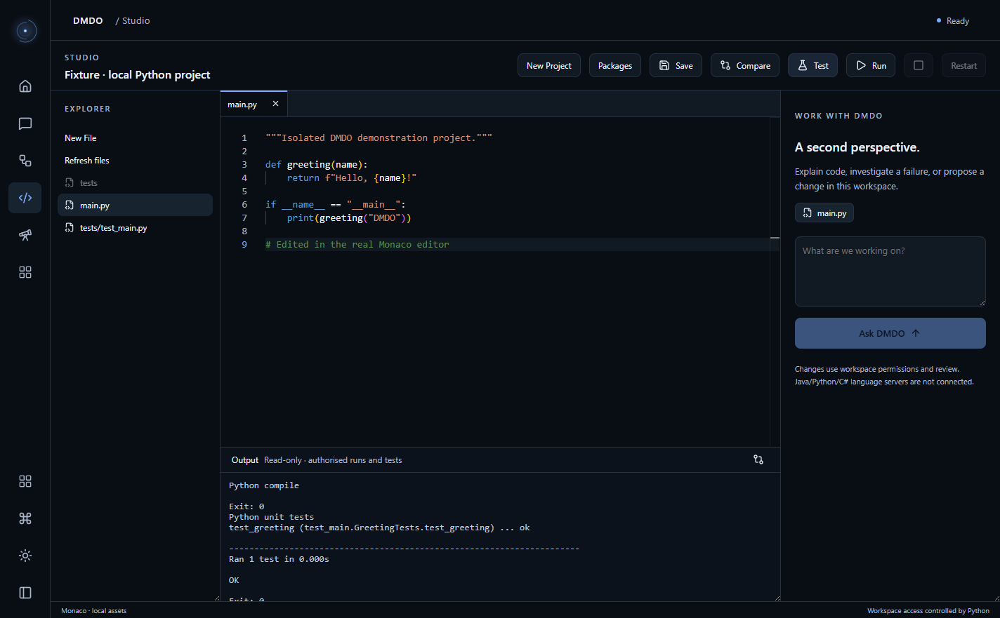

# Electron M1 visual review

> **Recovery checkpoint, 10 September 2026:** The material below is recovered
> historical documentation. Its test totals, security audit and approval claims
> are not fresh acceptance. See [RECOVERY_REPORT.md](RECOVERY_REPORT.md) for the
> current verified state. The latest brief requires a new visual-review stop.

**Working prototype ready for review; release and full action parity are not complete. User approval has not been given.**

The new application uses Electron/React/TypeScript with the existing Python service graph, not a Qt window embedded in Electron. Welcome, Home, All Spaces, Chat and a populated Monaco Studio run in one BrowserWindow. Home/Chat use the existing natural-language orchestrator. The default launcher remains Qt.

## Actual application evidence

All screenshots below are actual Electron application content. Populated records are explicitly synthetic fixtures. No private account or message is shown. The native window frame/taskbar is outside these captures.

[Actual interaction recording](evidence/m1-interaction.mp4) · [All Spaces](evidence/all-spaces.png) · [Empty Home](evidence/home-empty.png) · [Light theme](evidence/home-light.png) · [Real local streaming](evidence/chat-live-stream.png) · [Conflict comparison](evidence/studio-conflict-comparison.png) · [Real program output](evidence/studio-run-output.png)

The recording consists of 83 captured Electron screencast frames, encoded locally with FFmpeg. It shows Welcome → Home → Chat → Studio, approval, editing and actual validation output. It is not a rendered mockup or fabricated model response. The separate live Chat capture uses actual qwen3:8b inference.

## Verified checkpoint

| Evidence class | Check | Result |
| --- | --- | --- |
| UNIT / existing integration suite | Python | 531 passed; targeted compile passed |
| LIVE LOCAL fixture harness | Retained Qt | 49/49 passed |
| UNIT / component / contract | Frontend | 5 passed; strict TypeScript and lint passed |
| LIVE LOCAL | Electron acceptance | 4/4 passed with live inference explicitly enabled |
| LIVE LOCAL interpretation only | Original / expanded / compound | 37/37, 145/145, 4/4 at fresh baseline; no actions executed by evaluations |
| LIVE LOCAL | Studio | Actual Monaco edit, navigation retention, approved hash save, compile + one real fixture unit test, actual Run output |
| LIVE LOCAL | Concurrent disk change | Save blocked; disk and unsaved buffer preserved; side-by-side comparison opened |
| LIVE LOCAL | Chat | Actual Ollama stream, cancel, route retention; separate renderer-refresh draft retention |
| UNIT + LIVE LOCAL | Boundary | Invalid methods/arguments/links rejected; sandbox settings verified; approval identity/revision fingerprint and deduplication tests pass |
| Dependency audit | Pinned npm graph | Zero known findings after DOMPurify patch override |

The disk change is a simulated agent write in an isolated fixture, not evidence that a live coding agent autonomously made the edit. No external message was sent. No private account or physical desktop-control acceptance was performed.

## Measurements and limits

| Sample | Observed |
| --- | --- |
| Welcome visible after Electron launch, warm local environment | 383–391 ms in final runs |
| Navigation measured through Playwright click/visibility | 148 ms first sample, 34 ms cached sample |
| First visible live Chat output including interpretation/model work | 14.7 seconds |
| Electron + Python process working-set sum | Approximately 514 MiB, 8 processes; excludes Ollama |
| Earlier Qt checkpoint | 1,955–2,020 ms first paint; 341–353 MiB at 100% scaling |

The Qt numbers are historical checkpoint evidence, not freshly remeasured comparable timing. Qt measured a paint callback; Electron measured automation visibility. These are not controlled cold-start benchmarks and do not prove a performance improvement. GPU utilization/VRAM, combined Ollama memory, sustained frame rate, hard-crash cleanup and cold-machine startup remain unmeasured.

1366×768 and 1920×1080 content sizes, keyboard entry/palette, light/dark, reduced motion and 125/150% application text zoom were exercised. Application zoom is not OS DPI or multi-monitor testing. Visual inspection found readable light/dark surfaces and a coherent editor palette; it is not accessibility certification. Full action-focused accessibility, busy/disabled states and large-data virtualization remain later acceptance work.

## Scope still required

The ledger retains 1,606 individual rows, including every earlier 3.5 obligation. No native domain is accepted because a card exists. Current row counts are in COUNTS.json; implemented, tested, reviewed and user-approved states remain separate. Framework-only Qt instructions and the obsolete v3.5.0 tag instruction have explicit supersession notes.

- **M2:** Agent, Research, Desktop Control, Projects, Knowledge, Memory, Settings and Diagnostics React workspaces; remaining Chat attachment/branch/project/history actions; complete Studio Git/checkpoint/diagnostic/actions; complete command palette/settings search; exact durable Continue context and broader contextual handoffs.
- **M3:** Identity, Contacts, Calendar, Personal Tasks, Reminders, local Mail, SMTP/IMAP management, vault, imports/exports, native capabilities and cross-feature composition. These remain planned, not implemented.
- **M4:** comprehensive crash/recovery and process-tree cleanup, replay-by-sequence/backpressure refinement, remove the conservative 2,048-request runtime cap, stronger large-list/editor performance evidence, complete backup/restore/migrations, full security and accessibility matrix, production Python artifact, packaging/clean-machine validation and final visual approval.
- **Prototype limits:** no interactive PTY, LSP or debugger; output is read-only. Some action parity remains in Qt. Core covers observed Chat/bridge/run activity; full Research/Agent/desktop state integration is not yet accepted. Full task-specific cancellation from the activity list remains unfinished. No claim of universal app automation is made.
- **Olive:** the original source is unchanged and existing derived ICO is passed to BrowserWindow. Small taskbar rendering, exact derivative fidelity and packaged executable/shortcut identity still require review/build evidence.

These are delivery sequencing and explicit open obligations, not an agreed scope reduction. Do not propagate this design to remaining workspaces or build Personal Core interfaces until the user approves or revises this prototype.

## Open the isolated preview

Run `scripts/launch_electron_preview.ps1` from this checkout. It creates a new temporary synthetic profile. Enter DMDO, open Chat, then Studio and select “Fixture · local Python project”. Open main.py; Save/Test/Run retain the normal local approval path. Ctrl+Shift+P opens commands; the small Core opens activity and appearance controls.

No v3.5.0 or v3.5.1 tag exists. Prior release tags and the default launcher are preserved.
